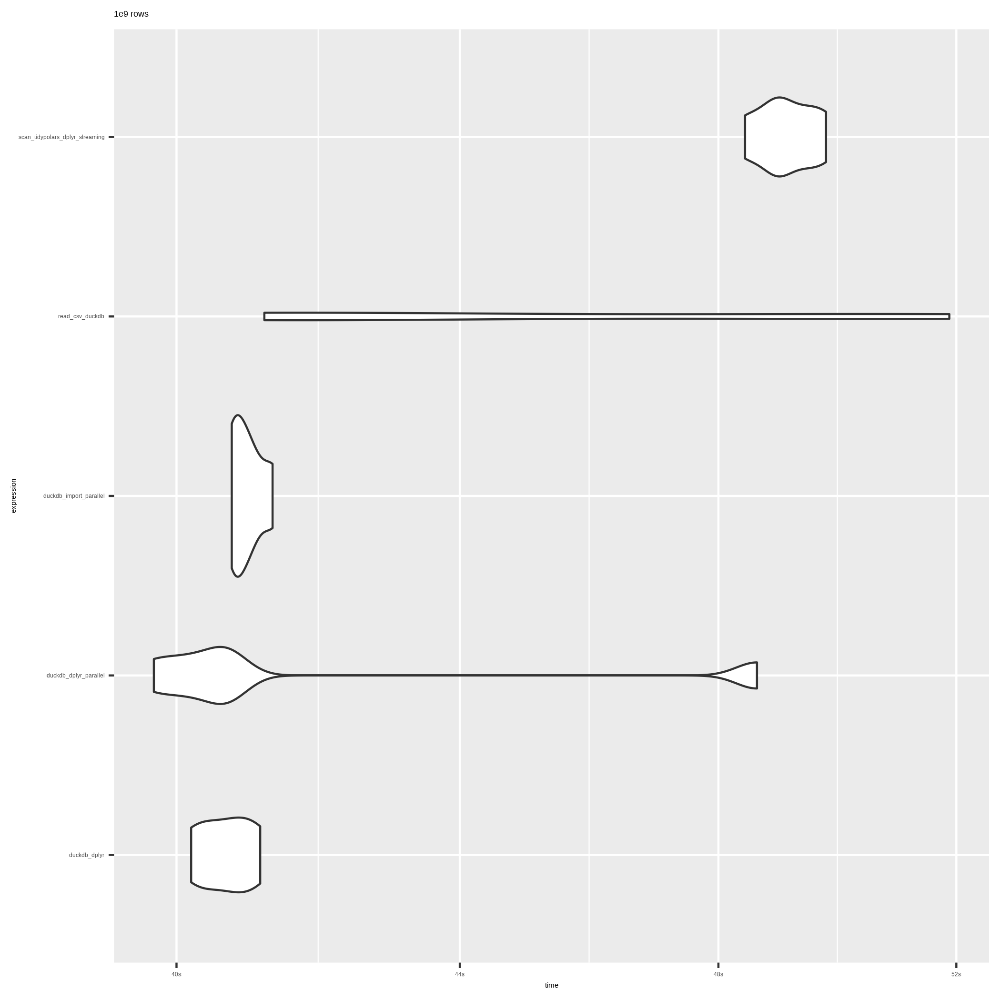
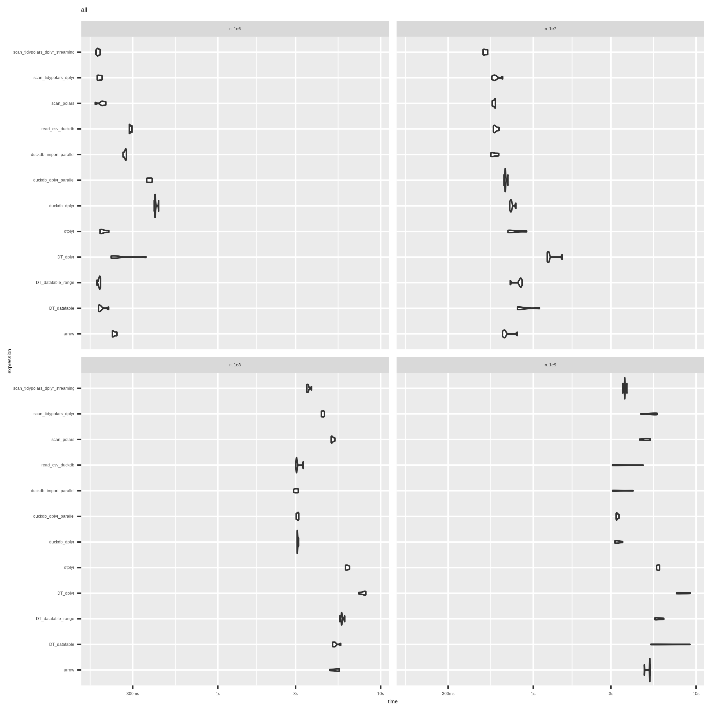
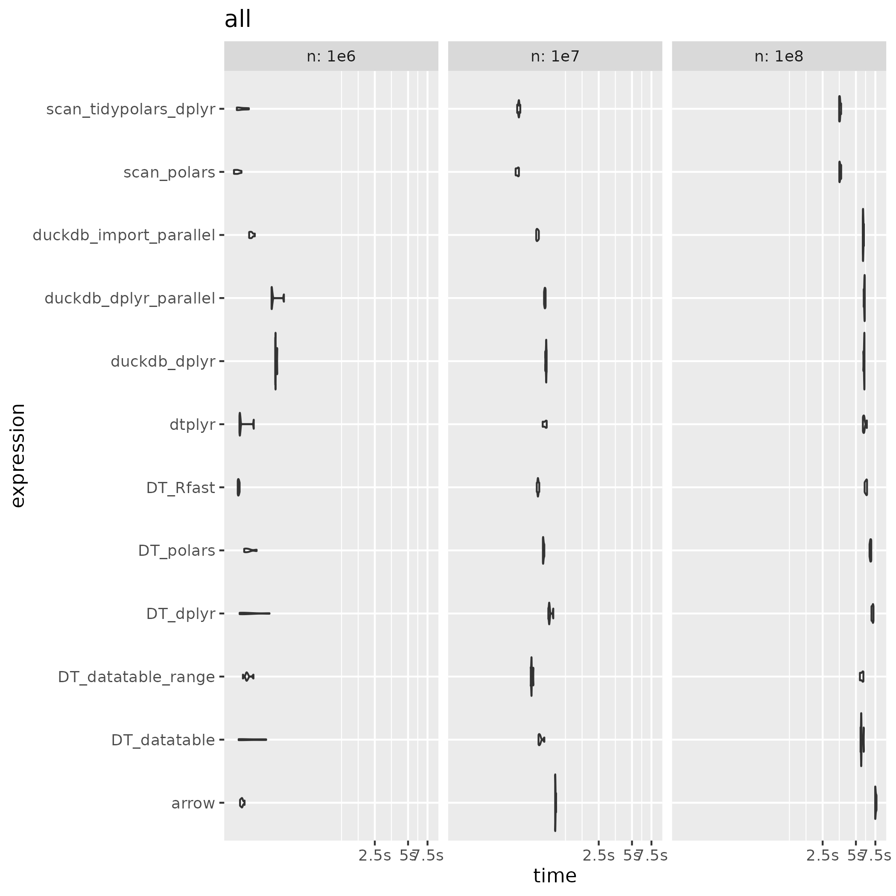

---
output:
  github_document:
    html_preview: false
---


## 1br


### Introduction

This is 1 Billion Row challenge with R. <em>Note that 1 billion in english = 1 millardo en español = 10e9.</em>

- This is the repo inspired by [Gunnar Morlng's](https://www.morling.dev/blog/one-billion-row-challenge/) 1 billion row challenge to see which functions / libraries are quickest in summarizing the mean, min and max of a 1 billion rows of record
- This work is based on [alejandrohagan/1br](https://github.com/alejandrohagan/1br) and [#5](https://github.com/alejandrohagan/1br/issues/5).
- I added some duckdb options and the polars scan option. In order to do it I've added a file copy and file reading steps in each benchmark method to be sure to compare the pipelines without caching and a maximum of 8 threads.
- If you see any issues or have suggestions of improvements, please let me know.


### Instructions

-   Generate 1e5, 1e6, 1e7, 1e8, 1e9 data running: ./generate_data.sh
-   Run the benchmark running: Rscript run.R or Rscript run_all.R (Or execute run_small.R if you noly want to run only 1e5, 1e6, 1e7, 1e8).
-   Check the generated plots and the results.


### Results

#### 2025-09-22

It seems that duckdb, duckplyr and dplyr (with duckdb or tidypolars streaming backends) are good options for 1e9 rows.

```{r}
suppressPackageStartupMessages(library(tidyverse))

read_rds(here::here("output", "2025-09-22_all.rds")) |> 
  select(n, expression, median) |> 
  mutate(expression = map_chr(expression, deparse1)) |>
  mutate(expression = map_chr(expression, ~ {
    str_match(.x, 'print\\(\\"([^\\"]+)\\"\\)')[,2]
  })) |> 
  group_by(n) |> 
  arrange(median) |>   
  group_map(\(x, group) {
    x |> mutate(n = group$n) |> print()    
  }) |> 
  invisible()
```






#### 2024-02-29



 

### What can you do?

If you want, you have time and enough memory available in your computer, then you can try to run the benchmark yourself and get the results.

If you what, look at other languages solutions (run.php for PHP, run.cpp for C++ or onebrc/src/main.rs for rust)

Feedback is welcome. You can open an issue in this repo.
