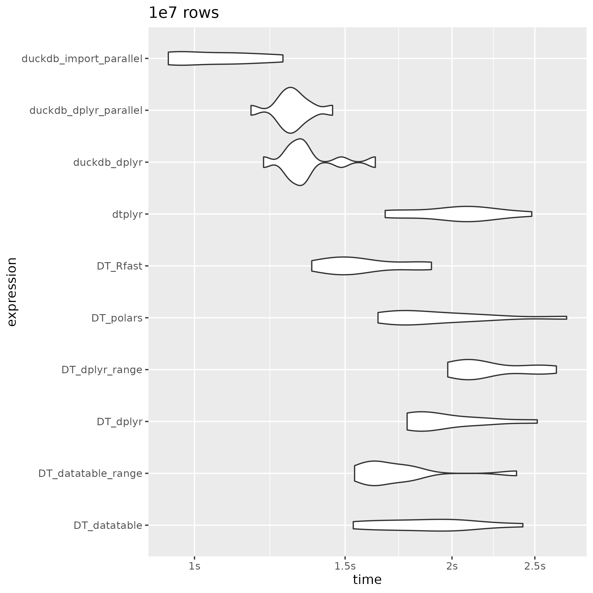
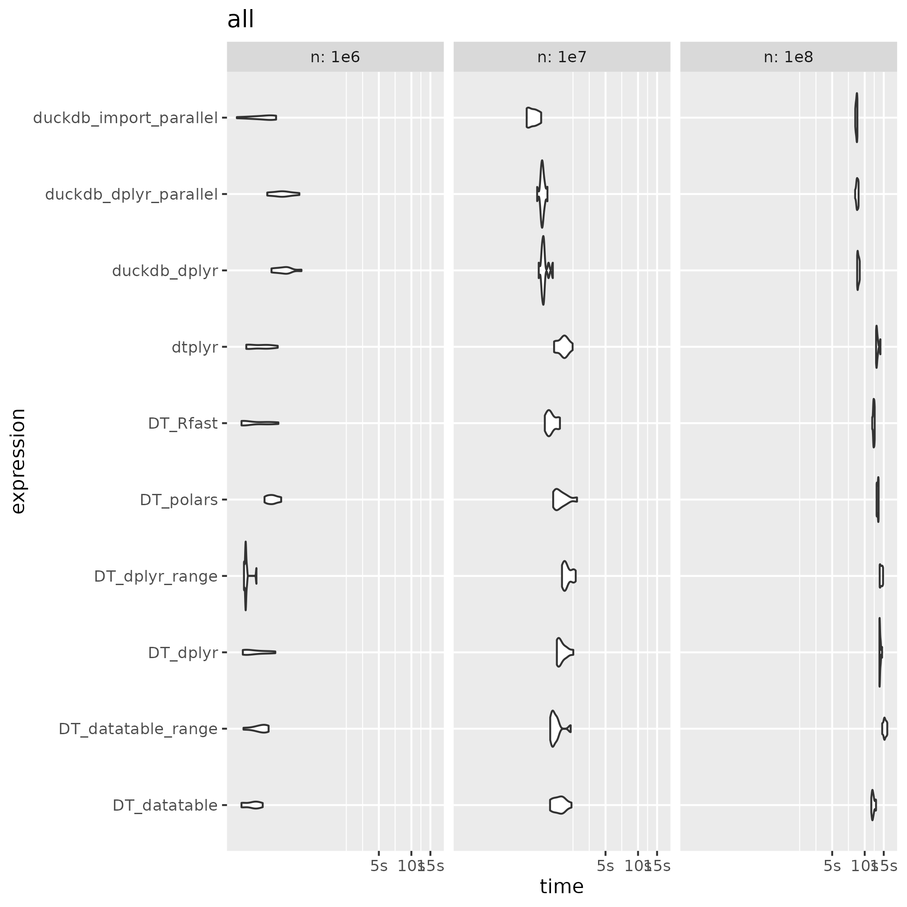

## 1br

### Introduction

1 Billion Row challenge with R:

* This is the repo inspired by [Gunnar Morlng's](https://www.morling.dev/blog/one-billion-row-challenge/) 1 billion row challenge to see which functions / libraries are quickest in summarizing the mean, min and max of a 1 billion rows of record
* This work is based on [alejandrohagan/1br](https://github.com/alejandrohagan/1br) and [#5](https://github.com/alejandrohagan/1br/issues/5), but I've only used 1e8 rows.
* I've added the reading part in the benchmark and some duckdb options.
* If you see any issues or have suggestions of improvements, please let me know.

### Instructions

* If you need, execute install_required_packages(install = TRUE) from install.R file.
* Generate 1e6, 1e7, and 1e8 data running: ./generate_data.sh
* Run the benchmark running: Rscript run.R
* Check the generated plots and the results


### Results








```
readr::read_rds("2024-02-21_all.rds")  %>% 
  group_split(n)
# [[1]]
# # A tibble: 10 × 14
#    expression n     min        median     `itr/sec` mem_alloc  `gc/sec` n_itr  n_gc total_time result memory     time      
#    <bnch_xpr> <chr> <bench_tm> <bench_tm>     <dbl> <bnch_byt>    <dbl> <int> <dbl> <bench_tm> <list> <list>     <list>    
#  1 <language> 1e6   0.2424677  0.4622831       2.30  1000328       0       10     0 4.338457   <NULL> <Rprofmem> <bench_tm>
#  2 <language> 1e6   0.4634586  0.6258041       1.54 12872056       1.54    10    10 6.474382   <NULL> <Rprofmem> <bench_tm>
#  3 <language> 1e6   0.5073918  0.6581770       1.51   814752       1.51    10    10 6.643278   <NULL> <Rprofmem> <bench_tm>
#  4 <language> 1e6   0.2754305  0.3315290       2.77 49737240       0       10     0 3.609068   <NULL> <Rprofmem> <bench_tm>
#  5 <language> 1e6   0.2821889  0.2929826       3.34 54857456       0       10     0 2.992443   <NULL> <Rprofmem> <bench_tm>
#  6 <language> 1e6   0.2677176  0.3483793       2.95 46002768       0       10     0 3.389178   <NULL> <Rprofmem> <bench_tm>
#  7 <language> 1e6   0.2793367  0.4153582       2.49 30000824       0       10     0 4.014296   <NULL> <Rprofmem> <bench_tm>
#  8 <language> 1e6   0.2679001  0.2843621       2.77 41690640       0       10     0 3.616419   <NULL> <Rprofmem> <bench_tm>
#  9 <language> 1e6   0.4373531  0.5163882       1.92 18962296       0       10     0 5.205443   <NULL> <Rprofmem> <bench_tm>
# 10 <language> 1e6   0.2965936  0.3919988       2.51 55074216       0       10     0 3.978856   <NULL> <Rprofmem> <bench_tm>
# # ℹ 1 more variable: gc <list>

# [[2]]
# # A tibble: 10 × 14
#    expression n     min        median     `itr/sec` mem_alloc  `gc/sec` n_itr  n_gc total_time result memory     time      
#    <bnch_xpr> <chr> <bench_tm> <bench_tm>     <dbl> <bnch_byt>    <dbl> <int> <dbl> <bench_tm> <list> <list>     <list>    
#  1 <language> 1e7   0.9319574  1.054844       0.940    336040     0        10     0 10.63949   <NULL> <Rprofmem> <bench_tm>
#  2 <language> 1e7   1.1642739  1.303746       0.766    835544     0        10     0 13.04724   <NULL> <Rprofmem> <bench_tm>
#  3 <language> 1e7   1.2043329  1.332843       0.737    812296     0        10     0 13.56282   <NULL> <Rprofmem> <bench_tm>
#  4 <language> 1e7   1.7724901  1.883365       0.507 510308912     1.01     10    20 19.71502   <NULL> <Rprofmem> <bench_tm>
#  5 <language> 1e7   1.9773741  2.124761       0.450 590348152     1.67     10    37 22.21752   <NULL> <Rprofmem> <bench_tm>
#  6 <language> 1e7   1.5333013  1.880838       0.531 458515576     0.531    10    10 18.82735   <NULL> <Rprofmem> <bench_tm>
#  7 <language> 1e7   1.5387371  1.657225       0.575 299319448     0.345    10     6 17.38172   <NULL> <Rprofmem> <bench_tm>
#  8 <language> 1e7   1.3712055  1.540541       0.630 416078096     0.630    10    10 15.86213   <NULL> <Rprofmem> <bench_tm>
#  9 <language> 1e7   1.6388201  1.850385       0.511 176099600     0        10     0 19.55555   <NULL> <Rprofmem> <bench_tm>
# 10 <language> 1e7   1.6708610  2.042702       0.492 538541240     0.542    10    11 20.30508   <NULL> <Rprofmem> <bench_tm>
# # ℹ 1 more variable: gc <list>

# [[3]]
# # A tibble: 10 × 14
#    expression n     min        median     `itr/sec` mem_alloc  `gc/sec` n_itr  n_gc total_time result memory     time      
#    <bnch_xpr> <chr> <bench_tm> <bench_tm>     <dbl> <bnch_byt>    <dbl> <int> <dbl> <bench_tm> <list> <list>     <list>    
#  1 <language> 1e8    8.175823   8.420775     0.119      336040   0         10     0  84.00612  <NULL> <Rprofmem> <bench_tm>
#  2 <language> 1e8    8.152539   8.527481     0.117      835544   0         10     0  85.28490  <NULL> <Rprofmem> <bench_tm>
#  3 <language> 1e8    8.514820   8.681562     0.115      812296   0         10     0  87.23101  <NULL> <Rprofmem> <bench_tm>
#  4 <language> 1e8   13.693455  13.779144     0.0721 4834249776   0.159     10    22 138.69944  <NULL> <Rprofmem> <bench_tm>
#  5 <language> 1e8   13.759483  14.236374     0.0703 5634289016   0.169     10    24 142.16871  <NULL> <Rprofmem> <bench_tm>
#  6 <language> 1e8   11.507126  11.873916     0.0834 4584571080   0.0834    10    10 119.96235  <NULL> <Rprofmem> <bench_tm>
#  7 <language> 1e8   14.513553  15.247732     0.0652 2992587872   0.104     10    16 153.46941  <NULL> <Rprofmem> <bench_tm>
#  8 <language> 1e8   11.739792  12.131947     0.0825 4160494848   0.190     10    23 121.26758  <NULL> <Rprofmem> <bench_tm>
#  9 <language> 1e8   12.891255  13.262196     0.0758 1760516352   0         10     0 131.92728  <NULL> <Rprofmem> <bench_tm>
# 10 <language> 1e8   12.740934  12.913811     0.0761 5384596744   0.0989    10    13 131.38147  <NULL> <Rprofmem> <bench_tm>
# # ℹ 1 more variable: gc <list>
```

### What can I do?

If you want, you have time and you have enough memory available in your computer, then you can try get the results for 1e9 rows:

* Uncomment 1e9 lines on ./generate_data.sh
* Comment run.R:16 and uncomment run.R:17
* Generate 1e6, 1e7, 1e8 and 1e9 data running: ./generate_data.sh
* Run the benchmark running: Rscript run.R
* Check the generated plots.
* Share the results as an issue or PR.
