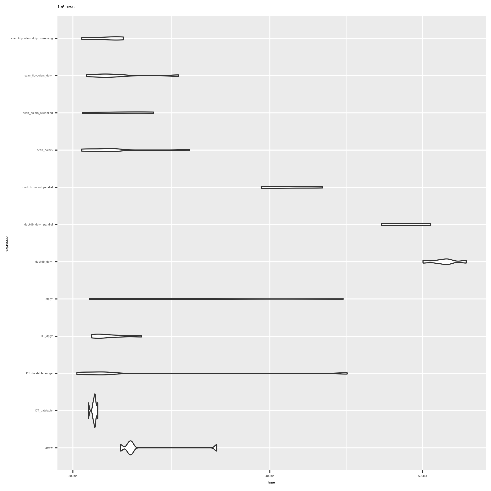
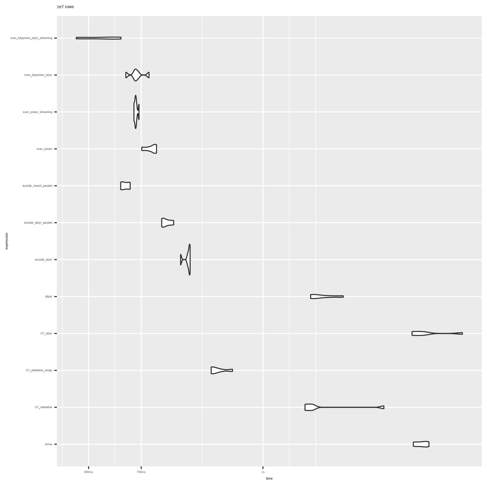
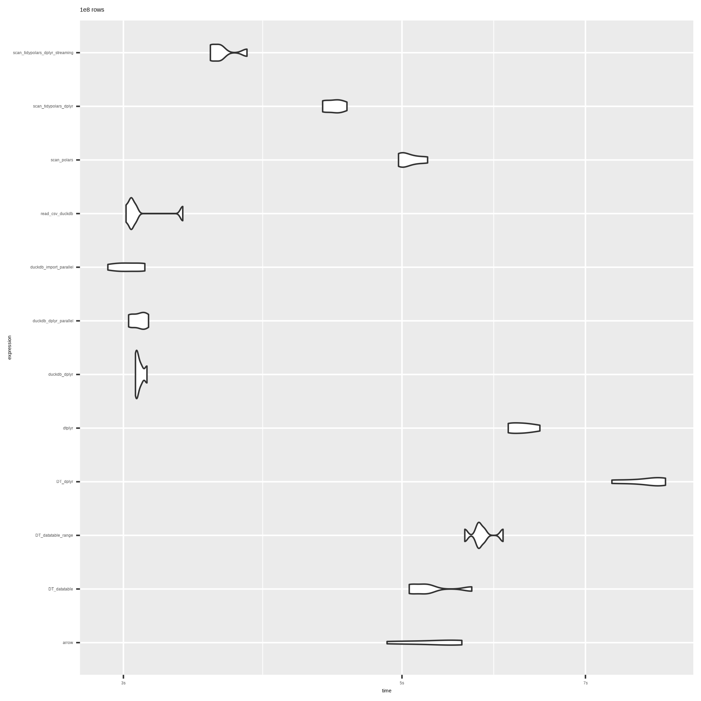
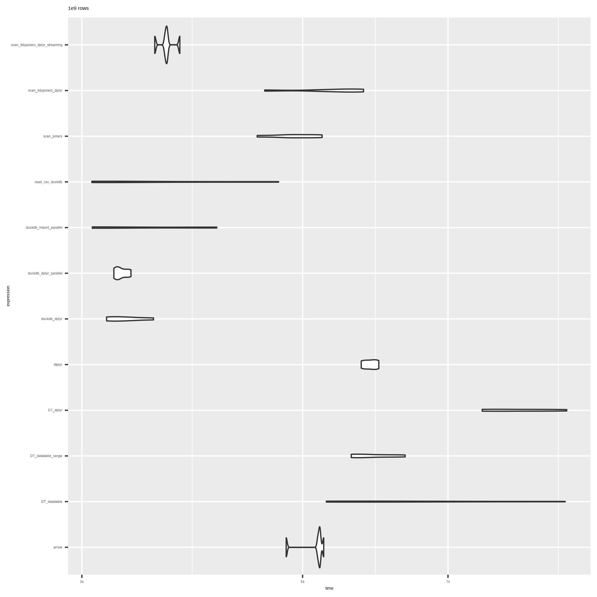
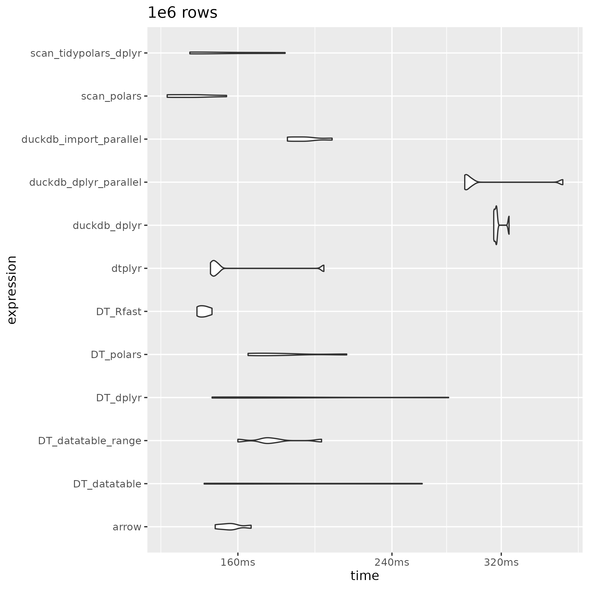
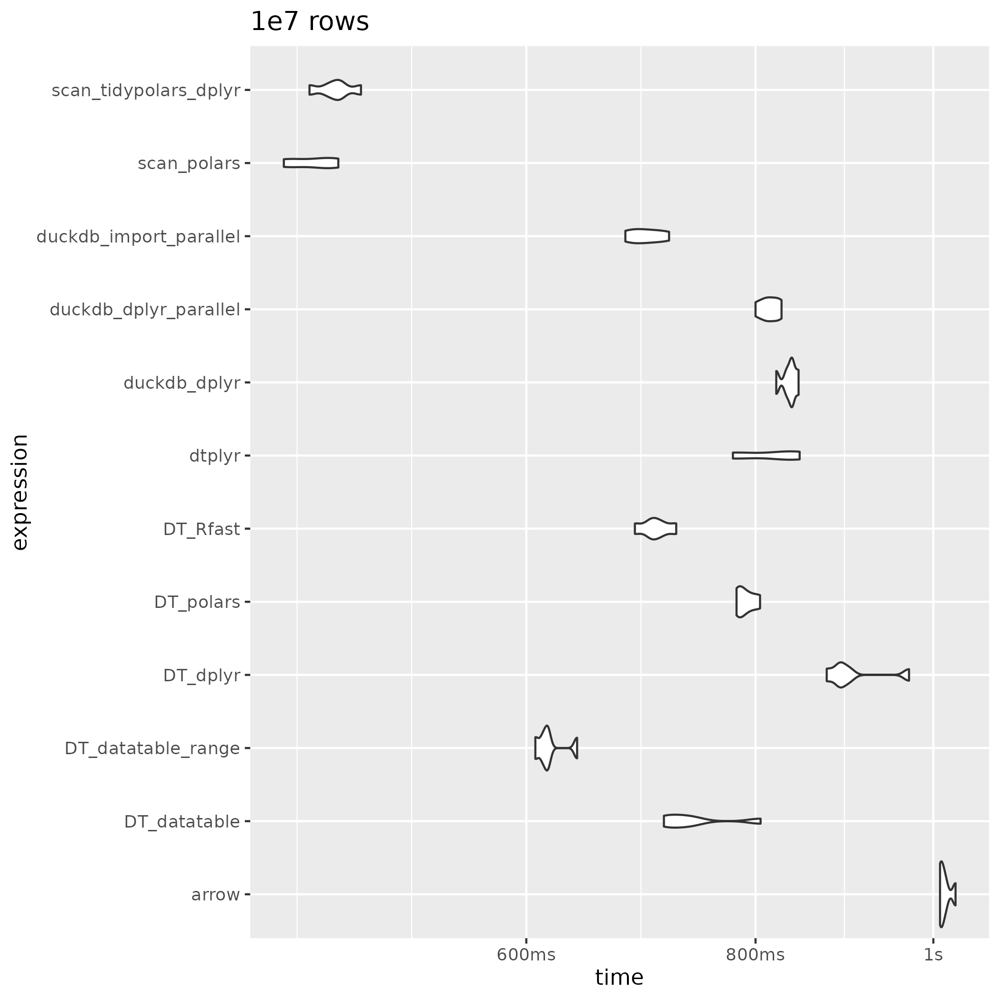
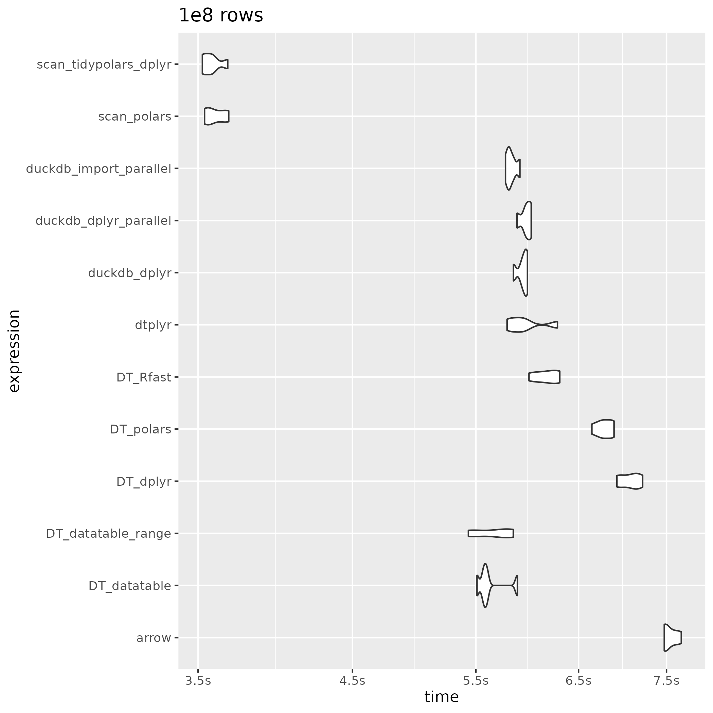

## 1br

### Introduction

This is 1 Billion Row challenge with R. <em>Note that 1 billion in
english = 1 millardo en español = 10e9.<em>

- This is the repo inspired by [Gunnar
  Morlng’s](https://www.morling.dev/blog/one-billion-row-challenge/) 1
  billion row challenge to see which functions / libraries are quickest
  in summarizing the mean, min and max of a 1 billion rows of record
- This work is based on
  [alejandrohagan/1br](https://github.com/alejandrohagan/1br) and
  [\#5](https://github.com/alejandrohagan/1br/issues/5).
- I added some duckdb options and the polars scan option. In order to do
  it I’ve added a file copy and file reading steps in each benchmark
  method to be sure to compare the pipelines without caching and a
  maximum of 8 threads.
- If you see any issues or have suggestions of improvements, please let
  me know.

### Instructions

- Generate 1e5, 1e6, 1e7, 1e8, 1e9 data running: ./generate_data.sh
- Run the benchmark running: Rscript run.R or Rscript run_all.R (Or
  execute run_small.R if you noly want to run only 1e5, 1e6, 1e7, 1e8).
- Check the generated plots and the results.

### Results

#### 2025-09-21

It seems duckdb, duckplyr and dplyr (with duckdb or tidypolars streaming
backends) are the fastest options for 1e9 rows.

``` r
suppressPackageStartupMessages(library(tidyverse))

read_rds(here::here("output", "2025-09-21_all.rds")) |> 
  select(n, expression, median) |> 
  mutate(expression = map_chr(expression, deparse1)) |>
  mutate(expression = map_chr(expression, ~ {
    str_match(.x, 'print\\(\\"([^\\"]+)\\"\\)')[,2]
  })) |> 
  group_by(n) |> 
  arrange(median) |>   
  group_map(\(x, group) {
    x |> mutate(n = group$n) |> print()    
  }) |> 
  invisible()
```

    ## # A tibble: 12 × 3
    ##    expression                        median n    
    ##    <chr>                           <bch:tm> <chr>
    ##  1 scan_tidypolars_dplyr_streaming    183ms 1e6  
    ##  2 scan_tidypolars_dplyr              187ms 1e6  
    ##  3 DT_datatable_range                 188ms 1e6  
    ##  4 DT_datatable                       189ms 1e6  
    ##  5 dtplyr                             194ms 1e6  
    ##  6 scan_polars                        195ms 1e6  
    ##  7 arrow                              227ms 1e6  
    ##  8 DT_dplyr                           238ms 1e6  
    ##  9 duckdb_import_parallel             271ms 1e6  
    ## 10 read_csv_duckdb                    287ms 1e6  
    ## 11 duckdb_dplyr_parallel              381ms 1e6  
    ## 12 duckdb_dplyr                       411ms 1e6  
    ## # A tibble: 12 × 3
    ##    expression                        median n    
    ##    <chr>                           <bch:tm> <chr>
    ##  1 scan_tidypolars_dplyr_streaming 505.63ms 1e7  
    ##  2 duckdb_import_parallel          567.38ms 1e7  
    ##  3 scan_tidypolars_dplyr           580.39ms 1e7  
    ##  4 read_csv_duckdb                 580.68ms 1e7  
    ##  5 scan_polars                     582.38ms 1e7  
    ##  6 arrow                           667.24ms 1e7  
    ##  7 duckdb_dplyr_parallel           672.71ms 1e7  
    ##  8 dtplyr                          721.74ms 1e7  
    ##  9 duckdb_dplyr                    730.85ms 1e7  
    ## 10 DT_datatable                    823.99ms 1e7  
    ## 11 DT_datatable_range              836.95ms 1e7  
    ## 12 DT_dplyr                           1.24s 1e7  
    ## # A tibble: 12 × 3
    ##    expression                        median n    
    ##    <chr>                           <bch:tm> <chr>
    ##  1 duckdb_import_parallel             3.02s 1e8  
    ##  2 read_csv_duckdb                    3.04s 1e8  
    ##  3 duckdb_dplyr                       3.08s 1e8  
    ##  4 duckdb_dplyr_parallel               3.1s 1e8  
    ##  5 scan_tidypolars_dplyr_streaming    3.58s 1e8  
    ##  6 scan_tidypolars_dplyr              4.43s 1e8  
    ##  7 scan_polars                        5.03s 1e8  
    ##  8 DT_datatable                       5.23s 1e8  
    ##  9 arrow                              5.39s 1e8  
    ## 10 DT_datatable_range                 5.75s 1e8  
    ## 11 dtplyr                             6.23s 1e8  
    ## 12 DT_dplyr                           7.94s 1e8  
    ## # A tibble: 12 × 3
    ##    expression                        median n    
    ##    <chr>                           <bch:tm> <chr>
    ##  1 duckdb_import_parallel             3.12s 1e9  
    ##  2 read_csv_duckdb                    3.18s 1e9  
    ##  3 duckdb_dplyr_parallel              3.26s 1e9  
    ##  4 duckdb_dplyr                        3.3s 1e9  
    ##  5 scan_tidypolars_dplyr_streaming    3.65s 1e9  
    ##  6 scan_polars                        4.89s 1e9  
    ##  7 arrow                               5.2s 1e9  
    ##  8 scan_tidypolars_dplyr              5.48s 1e9  
    ##  9 DT_datatable_range                 5.76s 1e9  
    ## 10 dtplyr                             5.86s 1e9  
    ## 11 DT_datatable                       6.08s 1e9  
    ## 12 DT_dplyr                           8.22s 1e9










#### 2024-02-29








### What can you do?

If you want, you have time and enough memory available in your computer,
then you can try to run the benchmark yourself and get the results.

If you what, look at other languages solutions (run.php for PHP or
onebrc for rust)

Feedback is welcome. You can open an issue in this repo.
