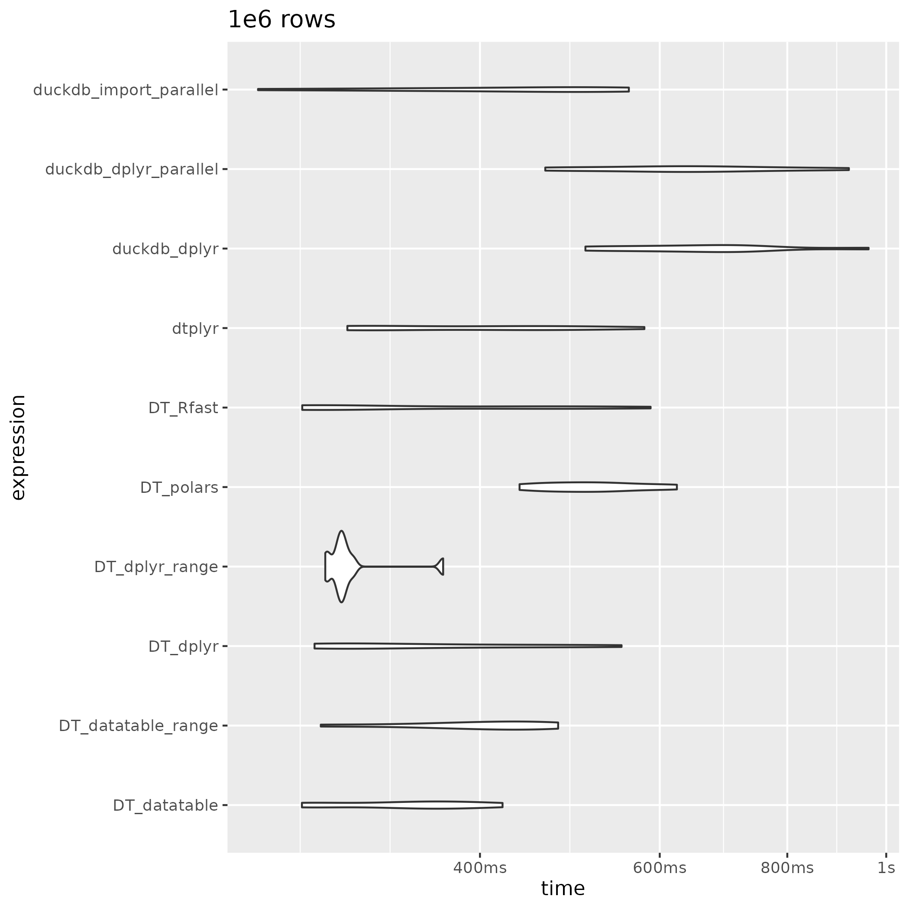
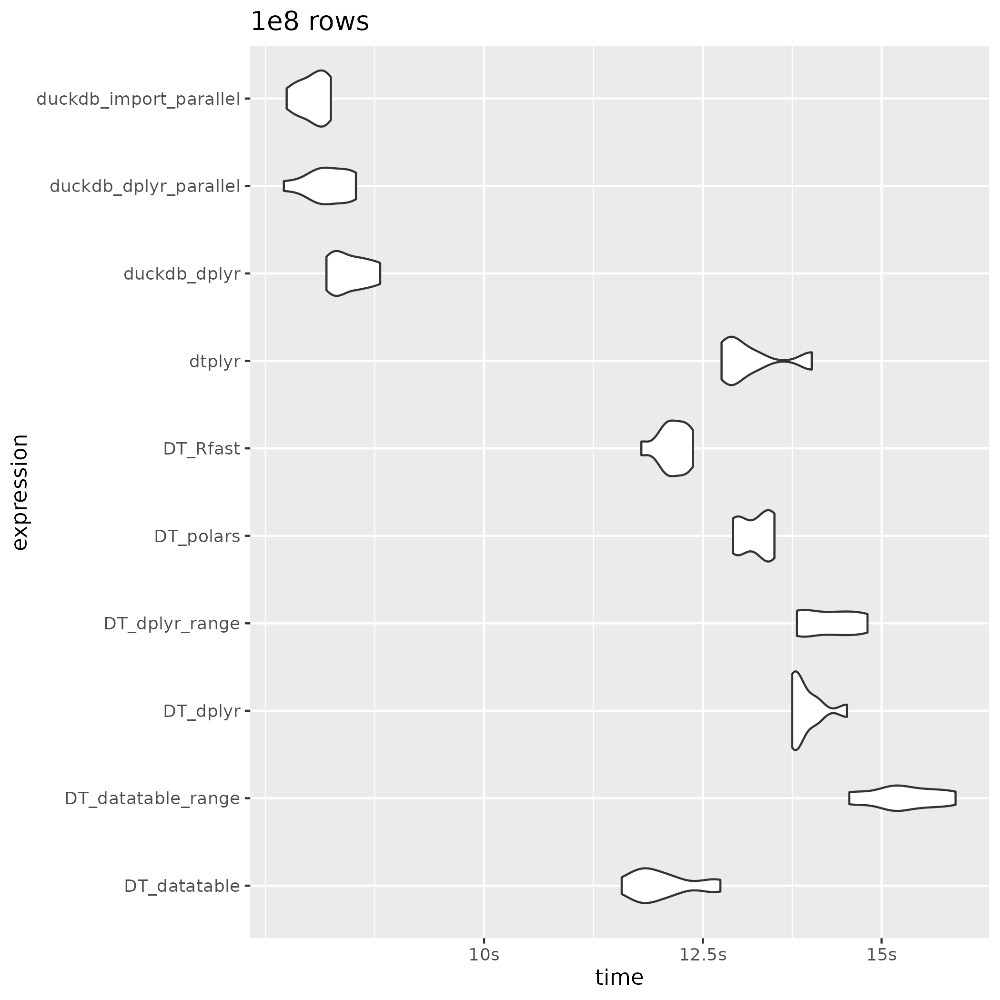
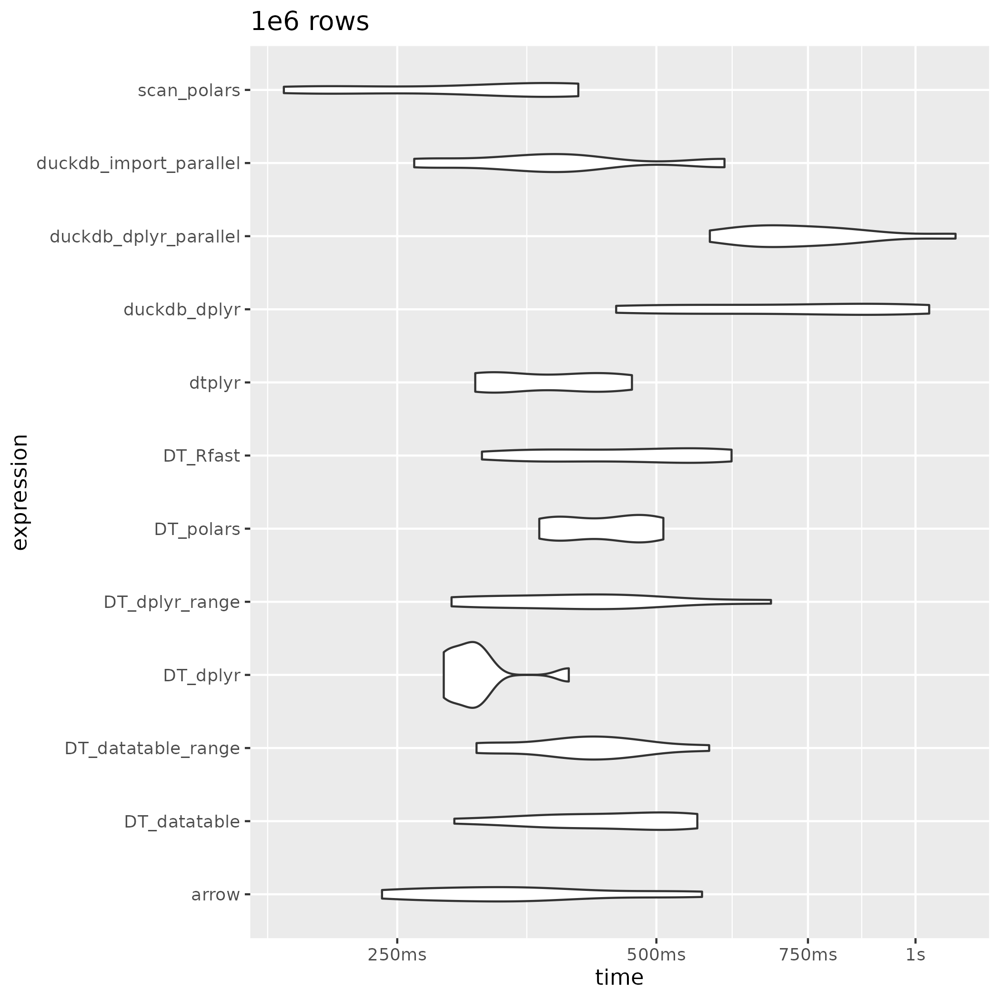
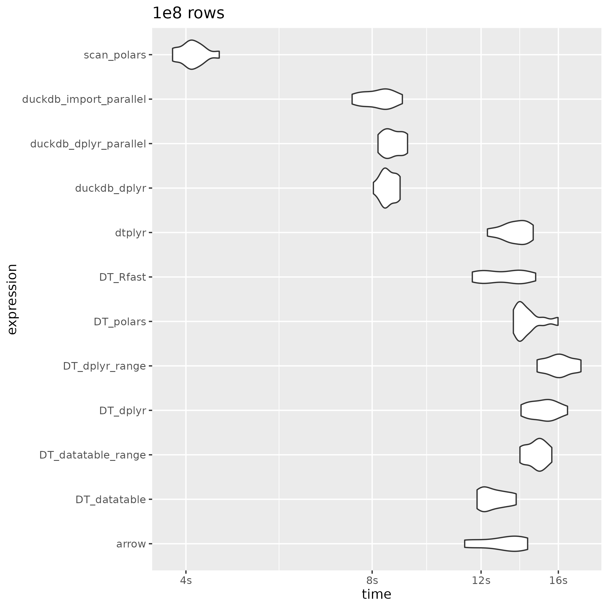
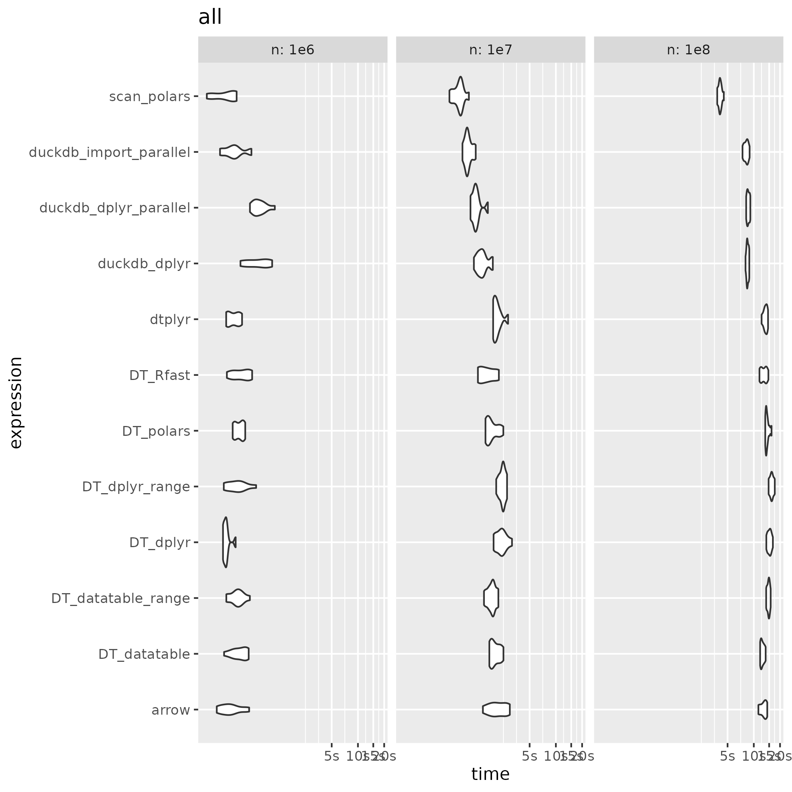

## 1br

### Introduction

1 Billion Row challenge with R:

-   This is the repo inspired by [Gunnar Morlng's](https://www.morling.dev/blog/one-billion-row-challenge/) 1 billion row challenge to see which functions / libraries are quickest in summarizing the mean, min and max of a 1 billion rows of record
-   This work is based on [alejandrohagan/1br](https://github.com/alejandrohagan/1br) and [#5](https://github.com/alejandrohagan/1br/issues/5), but I've only used 1e8 rows.
-   I've added the reading part in the benchmark and some duckdb options.
-   If you see any issues or have suggestions of improvements, please let me know.

### Instructions

-   If you need, execute install_required_packages(install = TRUE) from install.R file.
-   Generate 1e6, 1e7, and 1e8 data running: ./generate_data.sh
-   Run the benchmark running: Rscript run.R
-   Check the generated plots and the results

### Results

#### 2024-02-21







```         
readr::read_rds("2024-02-21_all.rds")  %>% 
  group_split(n)
# [[1]]
# # A tibble: 10 × 14
#    expression n     min        median     `itr/sec` mem_alloc  `gc/sec` n_itr  n_gc total_time result memory     time      
#    <bnch_xpr> <chr> <bench_tm> <bench_tm>     <dbl> <bnch_byt>    <dbl> <int> <dbl> <bench_tm> <list> <list>     <list>    
#  1 <language> 1e6   0.2424677  0.4622831       2.30  1000328       0       10     0 4.338457   <NULL> <Rprofmem> <bench_tm>
#  2 <language> 1e6   0.4634586  0.6258041       1.54 12872056       1.54    10    10 6.474382   <NULL> <Rprofmem> <bench_tm>
#  3 <language> 1e6   0.5073918  0.6581770       1.51   814752       1.51    10    10 6.643278   <NULL> <Rprofmem> <bench_tm>
#  4 <language> 1e6   0.2754305  0.3315290       2.77 49737240       0       10     0 3.609068   <NULL> <Rprofmem> <bench_tm>
#  5 <language> 1e6   0.2821889  0.2929826       3.34 54857456       0       10     0 2.992443   <NULL> <Rprofmem> <bench_tm>
#  6 <language> 1e6   0.2677176  0.3483793       2.95 46002768       0       10     0 3.389178   <NULL> <Rprofmem> <bench_tm>
#  7 <language> 1e6   0.2793367  0.4153582       2.49 30000824       0       10     0 4.014296   <NULL> <Rprofmem> <bench_tm>
#  8 <language> 1e6   0.2679001  0.2843621       2.77 41690640       0       10     0 3.616419   <NULL> <Rprofmem> <bench_tm>
#  9 <language> 1e6   0.4373531  0.5163882       1.92 18962296       0       10     0 5.205443   <NULL> <Rprofmem> <bench_tm>
# 10 <language> 1e6   0.2965936  0.3919988       2.51 55074216       0       10     0 3.978856   <NULL> <Rprofmem> <bench_tm>
# # ℹ 1 more variable: gc <list>

# [[2]]
# # A tibble: 10 × 14
#    expression n     min        median     `itr/sec` mem_alloc  `gc/sec` n_itr  n_gc total_time result memory     time      
#    <bnch_xpr> <chr> <bench_tm> <bench_tm>     <dbl> <bnch_byt>    <dbl> <int> <dbl> <bench_tm> <list> <list>     <list>    
#  1 <language> 1e7   0.9319574  1.054844       0.940    336040     0        10     0 10.63949   <NULL> <Rprofmem> <bench_tm>
#  2 <language> 1e7   1.1642739  1.303746       0.766    835544     0        10     0 13.04724   <NULL> <Rprofmem> <bench_tm>
#  3 <language> 1e7   1.2043329  1.332843       0.737    812296     0        10     0 13.56282   <NULL> <Rprofmem> <bench_tm>
#  4 <language> 1e7   1.7724901  1.883365       0.507 510308912     1.01     10    20 19.71502   <NULL> <Rprofmem> <bench_tm>
#  5 <language> 1e7   1.9773741  2.124761       0.450 590348152     1.67     10    37 22.21752   <NULL> <Rprofmem> <bench_tm>
#  6 <language> 1e7   1.5333013  1.880838       0.531 458515576     0.531    10    10 18.82735   <NULL> <Rprofmem> <bench_tm>
#  7 <language> 1e7   1.5387371  1.657225       0.575 299319448     0.345    10     6 17.38172   <NULL> <Rprofmem> <bench_tm>
#  8 <language> 1e7   1.3712055  1.540541       0.630 416078096     0.630    10    10 15.86213   <NULL> <Rprofmem> <bench_tm>
#  9 <language> 1e7   1.6388201  1.850385       0.511 176099600     0        10     0 19.55555   <NULL> <Rprofmem> <bench_tm>
# 10 <language> 1e7   1.6708610  2.042702       0.492 538541240     0.542    10    11 20.30508   <NULL> <Rprofmem> <bench_tm>
# # ℹ 1 more variable: gc <list>

# [[3]]
# # A tibble: 10 × 14
#    expression n     min        median     `itr/sec` mem_alloc  `gc/sec` n_itr  n_gc total_time result memory     time      
#    <bnch_xpr> <chr> <bench_tm> <bench_tm>     <dbl> <bnch_byt>    <dbl> <int> <dbl> <bench_tm> <list> <list>     <list>    
#  1 <language> 1e8    8.175823   8.420775     0.119      336040   0         10     0  84.00612  <NULL> <Rprofmem> <bench_tm>
#  2 <language> 1e8    8.152539   8.527481     0.117      835544   0         10     0  85.28490  <NULL> <Rprofmem> <bench_tm>
#  3 <language> 1e8    8.514820   8.681562     0.115      812296   0         10     0  87.23101  <NULL> <Rprofmem> <bench_tm>
#  4 <language> 1e8   13.693455  13.779144     0.0721 4834249776   0.159     10    22 138.69944  <NULL> <Rprofmem> <bench_tm>
#  5 <language> 1e8   13.759483  14.236374     0.0703 5634289016   0.169     10    24 142.16871  <NULL> <Rprofmem> <bench_tm>
#  6 <language> 1e8   11.507126  11.873916     0.0834 4584571080   0.0834    10    10 119.96235  <NULL> <Rprofmem> <bench_tm>
#  7 <language> 1e8   14.513553  15.247732     0.0652 2992587872   0.104     10    16 153.46941  <NULL> <Rprofmem> <bench_tm>
#  8 <language> 1e8   11.739792  12.131947     0.0825 4160494848   0.190     10    23 121.26758  <NULL> <Rprofmem> <bench_tm>
#  9 <language> 1e8   12.891255  13.262196     0.0758 1760516352   0         10     0 131.92728  <NULL> <Rprofmem> <bench_tm>
# 10 <language> 1e8   12.740934  12.913811     0.0761 5384596744   0.0989    10    13 131.38147  <NULL> <Rprofmem> <bench_tm>
# # ℹ 1 more variable: gc <list>
```

#### 2024-02-22








```         
readr::read_rds("2024-02-22_all.rds")  %>% 
  group_split(n)
#   [[1]]
# # A tibble: 12 × 14
#    expression         n       min median `itr/sec` mem_alloc `gc/sec` n_itr  n_gc total_time result memory    
#    <bch:expr>         <chr> <bch> <bch:>     <dbl> <bch:byt>    <dbl> <int> <dbl>   <bch:tm> <list> <list>    
#  1 duckdb_import_par… 1e6   262ms  381ms      2.50   976.9KB     0       10     0      3.99s <NULL> <Rprofmem>
#  2 duckdb_dplyr_para… 1e6   577ms  723ms      1.32    12.5MB     1.32    10    10      7.58s <NULL> <Rprofmem>
#  3 duckdb_dplyr       1e6   449ms  738ms      1.37   978.3KB     1.37    10    10       7.3s <NULL> <Rprofmem>
#  4 DT_dplyr           1e6   283ms  304ms      3.23    47.4MB     0       10     0       3.1s <NULL> <Rprofmem>
#  5 DT_dplyr_range     1e6   289ms  411ms      2.37    52.3MB     0       10     0      4.22s <NULL> <Rprofmem>
#  6 DT_datatable       1e6   291ms  449ms      2.25    43.9MB     0       10     0      4.45s <NULL> <Rprofmem>
#  7 DT_datatable_range 1e6   309ms  418ms      2.39    28.6MB     0       10     0      4.19s <NULL> <Rprofmem>
#  8 DT_Rfast           1e6   314ms  464ms      2.15    39.8MB     0       10     0      4.65s <NULL> <Rprofmem>
#  9 arrow              1e6   240ms  338ms      2.79    47.8MB     0       10     0      3.59s <NULL> <Rprofmem>
# 10 scan_polars        1e6   185ms  345ms      3.20     894KB     0       10     0      3.13s <NULL> <Rprofmem>
# 11 DT_polars          1e6   366ms  446ms      2.29    17.3MB     0       10     0      4.37s <NULL> <Rprofmem>
# 12 dtplyr             1e6   308ms  375ms      2.64    52.5MB     0       10     0      3.78s <NULL> <Rprofmem>
# # ℹ 2 more variables: time <list>, gc <list>
# 
# [[2]]
# # A tibble: 12 × 14
#    expression    n          min   median `itr/sec` mem_alloc `gc/sec` n_itr  n_gc total_time result memory    
#    <bch:expr>    <chr> <bch:tm> <bch:tm>     <dbl> <bch:byt>    <dbl> <int> <dbl>   <bch:tm> <list> <list>    
#  1 duckdb_impor… 1e7    848.1ms 971.86ms     1.01   328.16KB    0        10     0      9.93s <NULL> <Rprofmem>
#  2 duckdb_dplyr… 1e7      1.05s    1.19s     0.817    1.04MB    0        10     0     12.24s <NULL> <Rprofmem>
#  3 duckdb_dplyr  1e7      1.15s    1.43s     0.685  986.69KB    0        10     0     14.59s <NULL> <Rprofmem>
#  4 DT_dplyr      1e7      1.93s    2.35s     0.419  486.67MB    0.753    10    18     23.89s <NULL> <Rprofmem>
#  5 DT_dplyr_ran… 1e7      2.07s    2.46s     0.409     563MB    1.51     10    37     24.44s <NULL> <Rprofmem>
#  6 DT_datatable  1e7      1.73s    1.92s     0.494  437.27MB    0.494    10    10     20.25s <NULL> <Rprofmem>
#  7 DT_datatable… 1e7       1.5s    1.89s     0.541  285.45MB    0.162    10     3     18.49s <NULL> <Rprofmem>
#  8 DT_Rfast      1e7      1.27s    1.62s     0.603   396.8MB    0.603    10    10     16.59s <NULL> <Rprofmem>
#  9 arrow         1e7      1.45s    2.11s     0.454  471.35MB    0.954    10    21     22.01s <NULL> <Rprofmem>
# 10 scan_polars   1e7   600.91ms 802.32ms     1.29    22.44KB    0        10     0      7.78s <NULL> <Rprofmem>
# 11 DT_polars     1e7      1.56s    1.68s     0.538  167.94MB    0        10     0     18.59s <NULL> <Rprofmem>
# 12 dtplyr        1e7      1.91s    2.08s     0.468  513.59MB    0.515    10    11     21.35s <NULL> <Rprofmem>
# # ℹ 2 more variables: time <list>, gc <list>
# 
# [[3]]
# # A tibble: 12 × 14
#    expression        n        min median `itr/sec` mem_alloc `gc/sec` n_itr  n_gc total_time result memory    
#    <bch:expr>        <chr> <bch:> <bch:>     <dbl> <bch:byt>    <dbl> <int> <dbl>   <bch:tm> <list> <list>    
#  1 duckdb_import_pa… 1e8    7.42s   8.3s    0.122   328.16KB   0         10     0      1.36m <NULL> <Rprofmem>
#  2 duckdb_dplyr_par… 1e8    8.18s  8.57s    0.116     1.04MB   0         10     0      1.44m <NULL> <Rprofmem>
#  3 duckdb_dplyr      1e8    8.04s  8.43s    0.118   986.69KB   0         10     0      1.42m <NULL> <Rprofmem>
#  4 DT_dplyr          1e8   13.92s 15.26s    0.0660     4.5GB   0.139     10    21      2.52m <NULL> <Rprofmem>
#  5 DT_dplyr_range    1e8   14.78s 16.09s    0.0623    5.25GB   0.156     10    25      2.67m <NULL> <Rprofmem>
#  6 DT_datatable      1e8   11.82s 12.41s    0.0794    4.27GB   0.0794    10    10       2.1m <NULL> <Rprofmem>
#  7 DT_datatable_ran… 1e8   13.87s 14.82s    0.0678    2.79GB   0.109     10    16      2.46m <NULL> <Rprofmem>
#  8 DT_Rfast          1e8   11.62s 13.12s    0.0768    3.88GB   0.169     10    22      2.17m <NULL> <Rprofmem>
#  9 arrow             1e8   11.29s 13.26s    0.0773    4.35GB   0.162     10    21      2.16m <NULL> <Rprofmem>
# 10 scan_polars       1e8    3.81s  4.09s    0.243    24.54KB   0         10     0     41.07s <NULL> <Rprofmem>
# 11 DT_polars         1e8   13.53s    14s    0.0700    1.64GB   0         10     0      2.38m <NULL> <Rprofmem>
# 12 dtplyr            1e8   12.29s 13.66s    0.0735    5.01GB   0.0956    10    13      2.27m <NULL> <Rprofmem>
# # ℹ 2 more variables: time <list>, gc <list>
```

### What can I do?

If you want, you have time and you have enough memory available in your computer, then you can try get the results for 1e9 rows:

-   Uncomment 1e9 lines on ./generate_data.sh
-   Comment run.R:16 and uncomment run.R:17
-   Generate 1e6, 1e7, 1e8 and 1e9 data running: ./generate_data.sh
-   Run the benchmark running: Rscript run.R
-   Check the generated plots.
-   Share the results as an issue or PR.

Feedback is welcome. You can open an issue in this repo.
