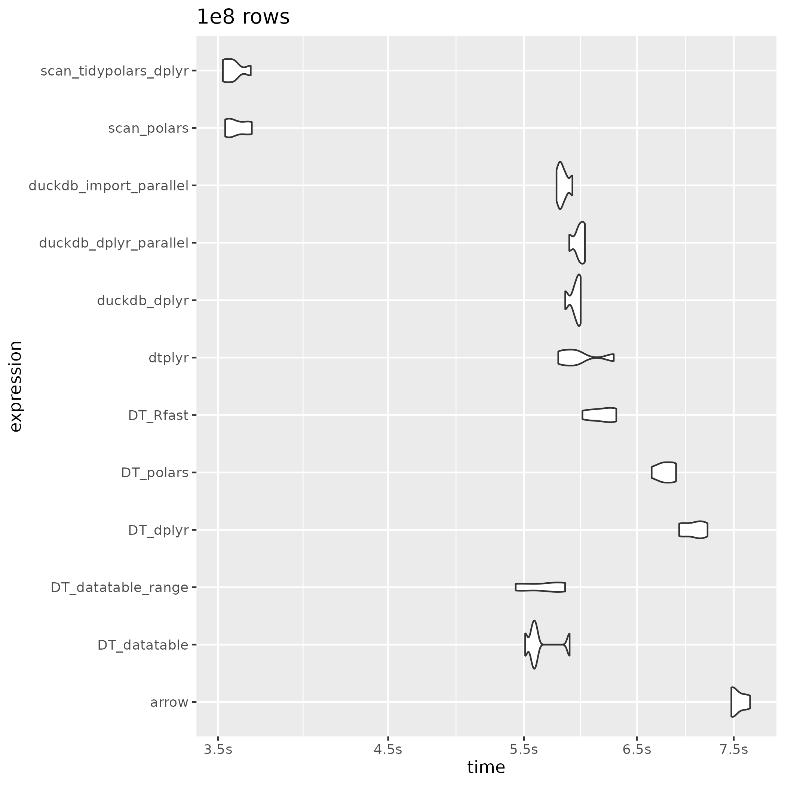

## 1br

### Introduction

1 Billion Row challenge with R:

-   This is the repo inspired by [Gunnar Morlng's](https://www.morling.dev/blog/one-billion-row-challenge/) 1 billion row challenge to see which functions / libraries are quickest in summarizing the mean, min and max of a 1 billion rows of record
-   This work is based on [alejandrohagan/1br](https://github.com/alejandrohagan/1br) and [#5](https://github.com/alejandrohagan/1br/issues/5), but I've only used 1e8 rows.
-   I added some duckdb options and polars scan option. In order to do it I've added a file copy and file reading steps in each benchmark method to be sure to compare the pipelines without caching and a maximum of 8 threads.
-   If you see any issues or have suggestions of improvements, please let me know.

### Instructions

-   If you need, execute install_required_packages(install = TRUE) from install.R file.
-   Generate 1e6, 1e7, and 1e8 data running: ./generate_data.sh
-   Run the benchmark running: Rscript run.R
-   Check the generated plots and the results

### Results

#### 2024-02-29





```         
readr::read_rds("2024-02-29_all.rds")  %>% 
  group_split(n)
```

### What can I do?

If you want, you have time and you have enough memory available in your computer, then you can try get the results for 1e9 rows:

-   Uncomment 1e9 lines on ./generate_data.sh
-   Comment run.R:16 and uncomment run.R:17
-   Generate 1e6, 1e7, 1e8 and 1e9 data running: ./generate_data.sh
-   Run the benchmark running: Rscript run.R
-   Check the generated plots.

Feedback is welcome. You can open an issue in this repo.
